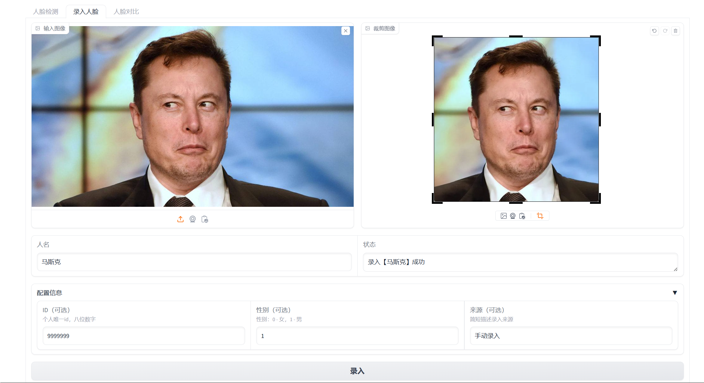
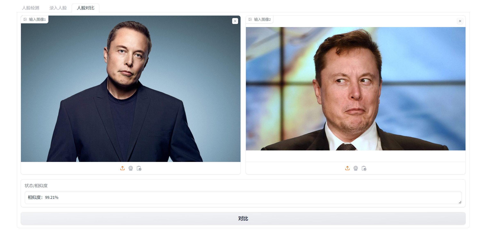

# 1. 介绍
## 1. 功能
基于 insightface 人脸识分析工具及 Milvus 向量数据库打造的人脸识别系统，支持人脸数据批量识别、检测、录入、对比等功能，并提供了易操作的可视化界面。
## 2. 环境要求
Python 3.8 以上版本，测试环境：Windows 11、Python 3.10.

GPU 要求：无，支持 GPU 推理。测试环境：RTX4060。
若需使用GPU，需安装对应 onnxruntime-gpu 版本，与cuda、cudnn版本对应关系参照 [CUDA Execution Provider](https://onnxruntime.ai/docs/execution-providers/CUDA-ExecutionProvider.html).
## 3. 项目结构
```
│
├── bin                 源代码目录
│   ├── config.py       配置
│   ├── db.py           数据库
│   ├── detect.py       检测
│   ├── similarity.py   相似度量化
│   └── ui.py           gradio ui 与逻辑
│
├── db_path             数据、日志文件目录
├── face_img            人脸录入原图、小图目录
├── tmp                 gradio 临时目录
├── img                 示例图片目录
├── .gitignore
├── LICENSE
├── main.py             入口文件
└── requirements.txt
```
# 2. 安装
## 1. 创建虚拟环境（可选）
创建Python独立环境并激活，也可使用conda
```commandline
   python -m venv venv
```
```commandline
   venv\Scripts\activate
```
## 2. 安装依赖
在虚拟环境中运行以下命令安装所需依赖，注意需要 Microsoft Visual C++ 14.0 及以上版本，否则安装 insightface 包会出错  
[VisualStudio 安装位置](https://visualstudio.microsoft.com/visual-cpp-build-tools/)
```commandline
   pip install -r requirements.txt
```
## 3. 运行 Milvus 数据库
运行 Milvus Lite，并持久化保存数据和日志，也可使用 Docker 部署，参见 [官方文档](https://milvus.io/docs/install_standalone-docker.md)
```commandline
   milvus-server --data db_path
```
## 4. 运行 Python 主程序
运行代码，在浏览器中打开可视化界面，默认 url：http://localhost:5000
```commandline
   python main.py
```
# 3. 使用
## 1. 人脸检测
下图为一张多人图片，可检测出数据库中人脸相似度超过给定阈值（默认70%）人物，未知人物相似度为 0.00%。  


## 2. 人脸录入
手动录入人脸，尽量选择正面、清晰度较高图片，以便提取特征。  
裁剪原图为包含人脸正方形小图，可设为人物头像，原图与小图在录入后保存于本地人脸图片目录。  
可选参数：  
- ID：录入角色唯一 id ，默认随机生成八位数字；
- 性别：录入角色性别，0 - 女， 1 - 男，默认自动识别；
- 来源：录入人脸来源，默认手动录入，批量录入可自行更改。

注意：一次仅支持录入一个人物。

下图为录入马斯克人脸数据示例。  


## 3. 人脸对比
对比两张图片人脸相似度，对比图像仅支持单人对比。
下图为对比马斯克不同图片示例。  


